<div align="center">

<!-- Animated Header Banner -->


<br/>

<!-- Tech Stack Badges - Modern soft rounded style with real logos -->
<p>

&nbsp;

&nbsp;

&nbsp;

&nbsp;

&nbsp;

&nbsp;

&nbsp;

&nbsp;

</p>

<!-- Status Badges -->
<p>

&nbsp;

&nbsp;

&nbsp;

</p>

<br/>

<!-- Nav Buttons -->
[](../../releases/latest)&nbsp;
[](./Ai%20interview%20trainer%20documentation%202.pdf)&nbsp;
[](./AI%20interview%20Screenshots.pdf)&nbsp;
[](https://www.linkedin.com/in/manush-g-r-8bbb23363/)

<br/><br/>

</div>

---

## 📖 About

**AI Interview Trainer** is an Android application that helps **students and job seekers** prepare for technical and behavioral interviews using Artificial Intelligence.

It combines **Google Gemini 2.5 Flash · Firebase · Jetpack Compose · CameraX · Google ML Kit** into one seamless interview practice platform — from resume upload all the way to progress analytics.

```
Upload Resume  →  AI Role Suggestion  →  Session Setup  →  Face Verify
      →  AI Questions  →  Voice Answer  →  AI Feedback  →  Progress
```

---

## ✨ Features

### 🔐 Authentication
- Email/password registration and login
- Google Sign-In via Firebase
- Persistent session management
- Secure user-based data isolation

### 👤 Profile Management
- Profile setup with name, college, graduation year, phone number
- Profile photo upload
- Editable profile anytime from the app

### 📄 Resume Upload & AI Analysis
- Upload resume as **PDF**
- **Gemini 2.5 Flash** extracts skills, experience level, and suggests roles
- Skip option available for manual role entry

### 🎯 Role Selection
- AI-suggested roles from resume analysis
- Manual selection from 15+ popular tech roles
- Add fully custom roles
- All roles saved to Firestore profile

### 🏠 Dashboard
- Live stats: total sessions · average score · best score
- One-tap **Start Practice** with AI-powered questions
- Quick actions: Mock Interview · My Progress · Update Resume
- Recent session history with role, date, and score

### ⚙️ Interview Session Setup

| Option | Choices |
|--------|---------|
| Target Role | From your saved roles |
| Difficulty | Easy / Medium / Hard |
| Category | Technical / Behavioral / Mixed |
| Questions | Configurable question count |
| Mode | Practice / Mock Interview |

### 👁️ Face Verification & Mock Interview Monitoring
- Pre-interview face scan using **Google ML Kit Face Detection**
- Continuous real-time monitoring during mock session
- Detects: No Face · Multiple Faces · Face Change
- Live status badge: **Stable** / **Not Visible** / **Suspicious**
- Malpractice counter — **3 violations → session terminated automatically**

### 🎤 Voice Answer
- Tap mic → speak → tap stop
- Live waveform animation during recording
- Speech-to-text transcription
- Submit for immediate AI evaluation

### 🤖 AI Feedback (per question)
- **Score** out of 100 + **Star rating** (1–5 ⭐)
- Performance label: Excellent / Good / Average / Poor
- **Strengths** · **Improve On** tips · **Model Answer**
- Next Question flow

### 📊 Progress & Analytics
- Trend bar chart across recent sessions
- Category star scores: Technical · Behavioral · Mixed
- Performance by role with percentage progress bars
- Full session history — role, date, type, score
- Streak counter for consistency tracking

---

## 📸 Screenshots

### 🔐 Authentication & Onboarding

| Splash | Login | Register | Profile Setup |
|:---:|:---:|:---:|:---:|
| 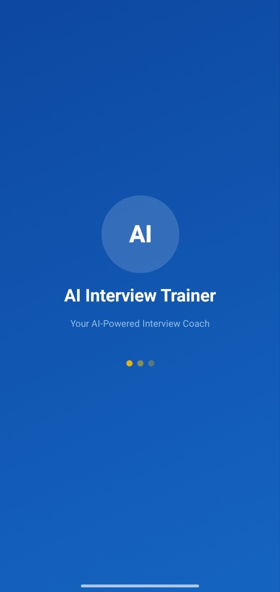 | 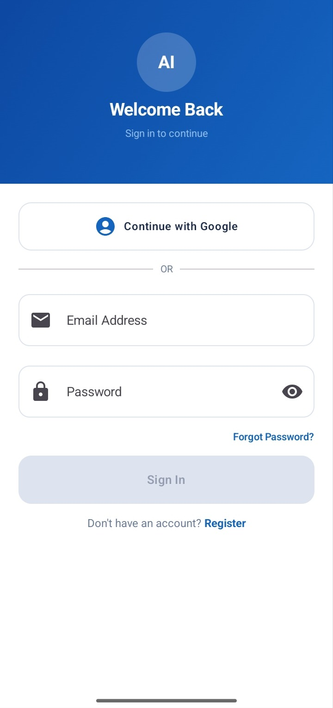 | 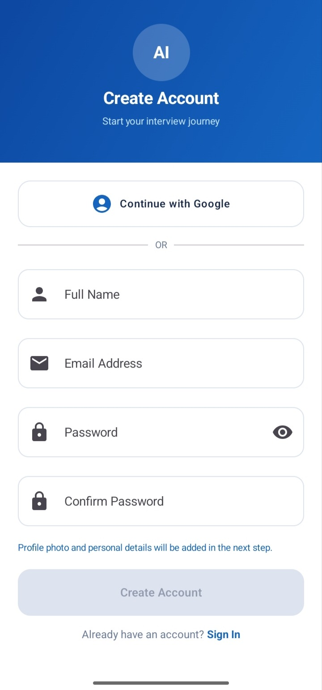 | 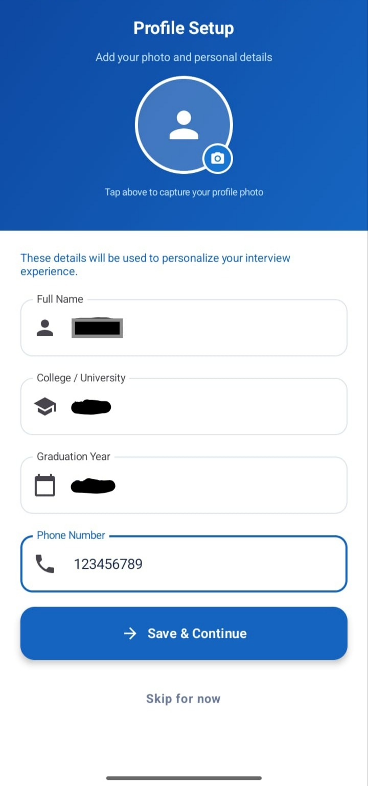 |

### 🏠 Dashboard & Profile

| Dashboard | Profile | Resume Upload | Resume Analysis |
|:---:|:---:|:---:|:---:|
| 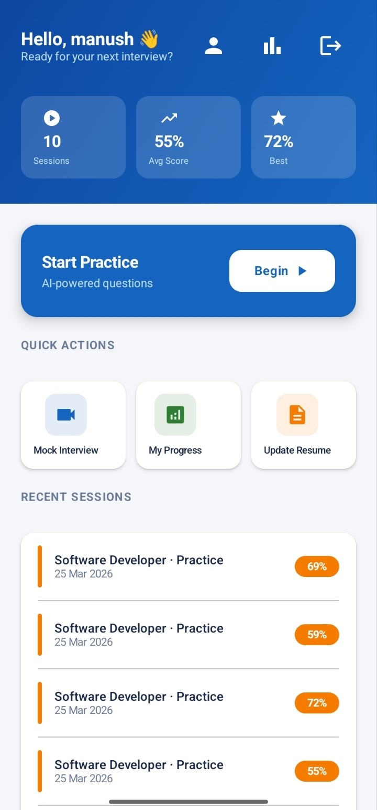 | 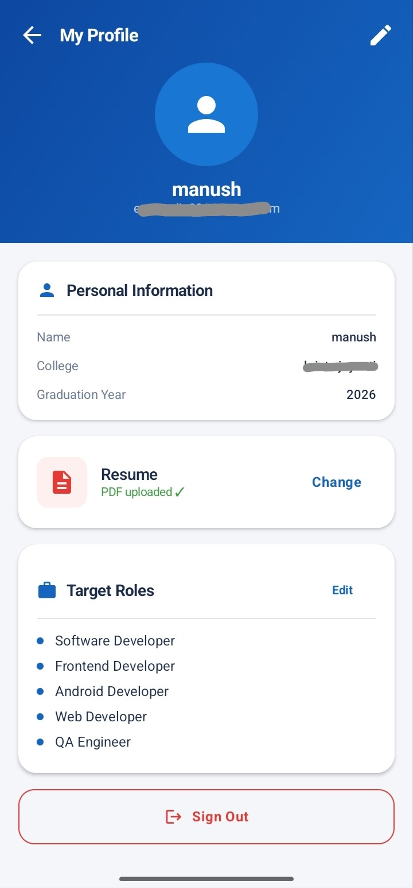 | 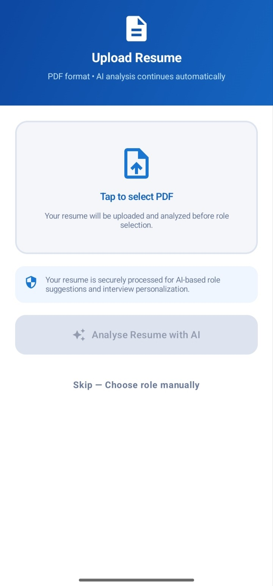 | 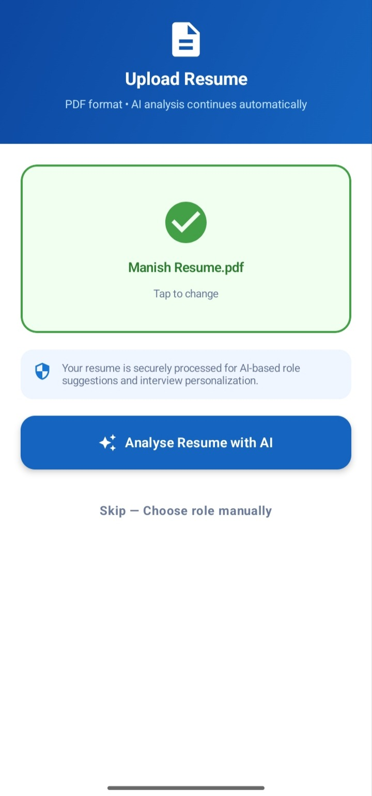 |

### 🎯 Role Selection & Session Setup

| AI Analysis | AI Role Suggestions | Manual Role Selection | Session Setup |
|:---:|:---:|:---:|:---:|
| 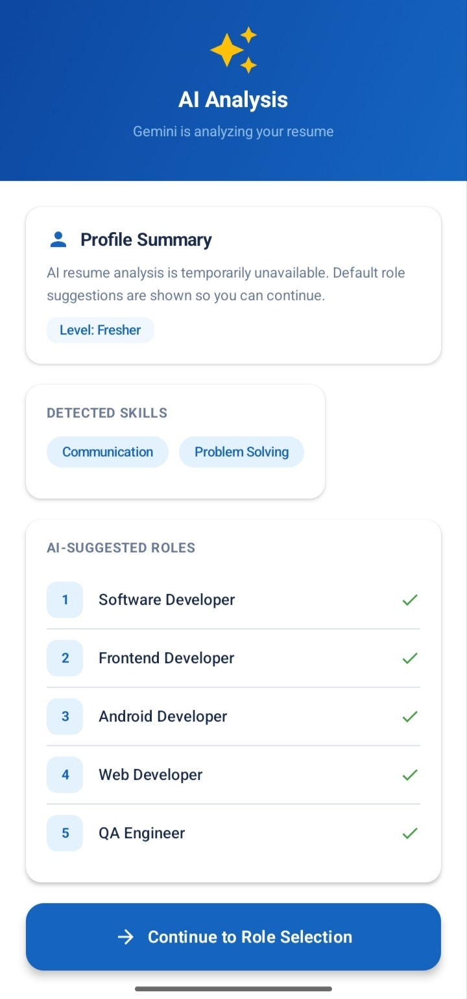 | 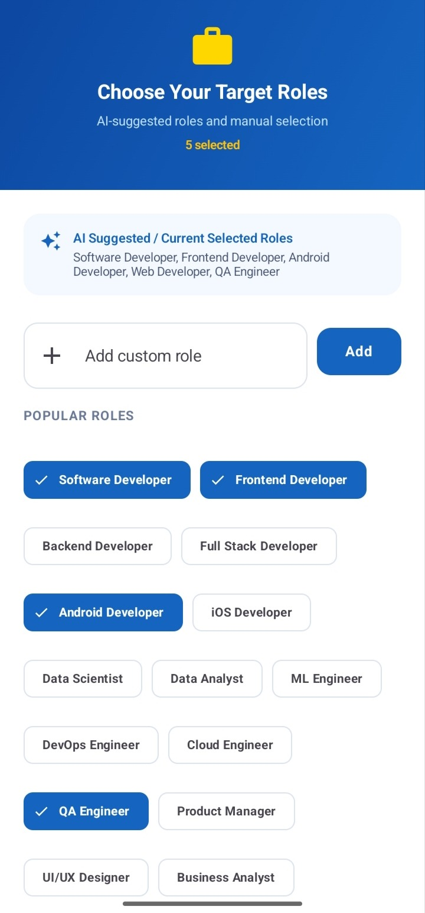 | 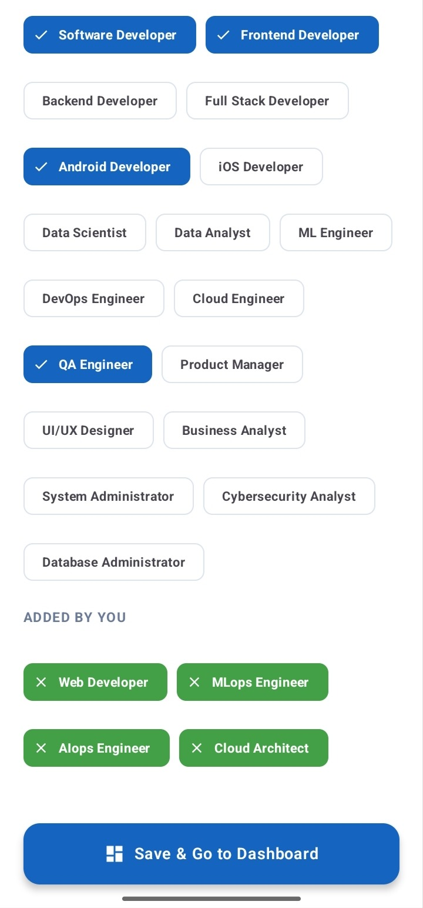 | 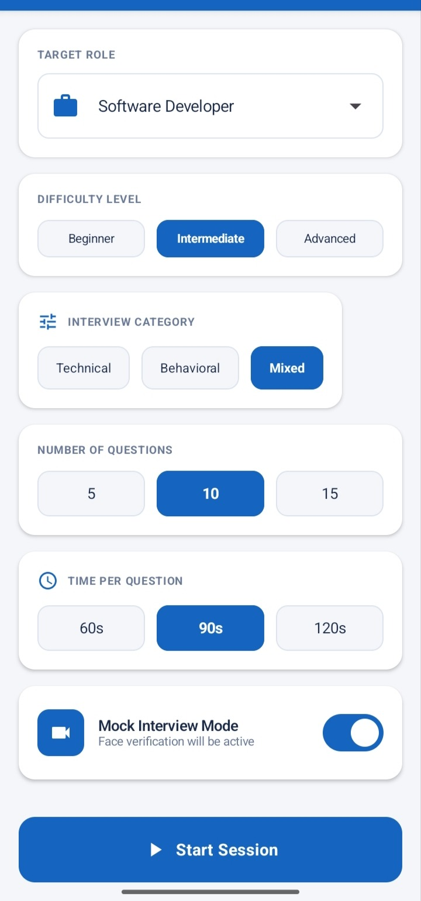 |

### 🎥 Mock Interview

| Face Verification | Mock Interview | Malpractice Detection | Voice Session Setup |
|:---:|:---:|:---:|:---:|
| 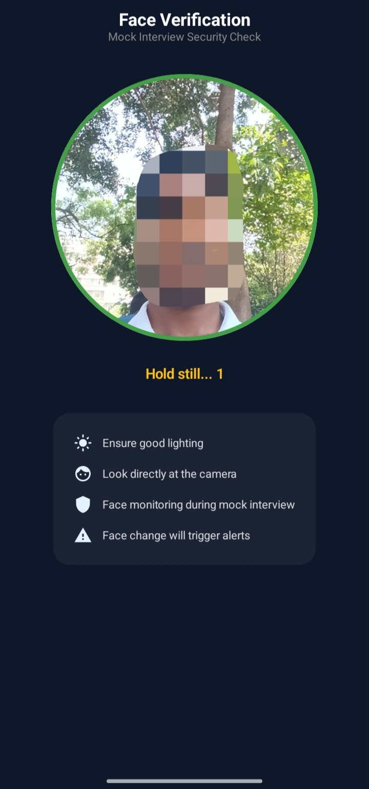 | 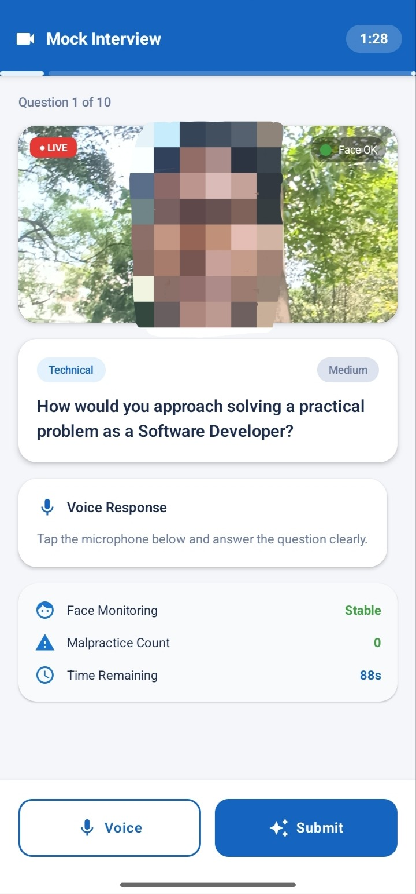 | 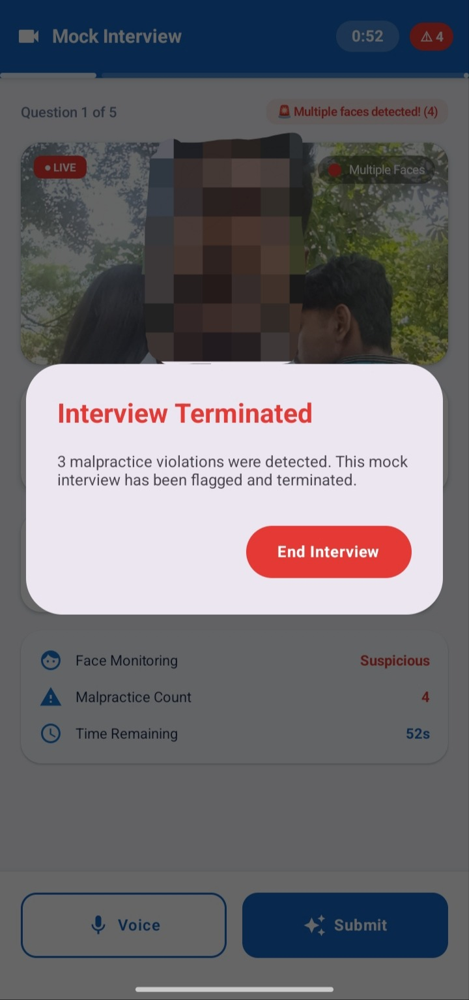 | 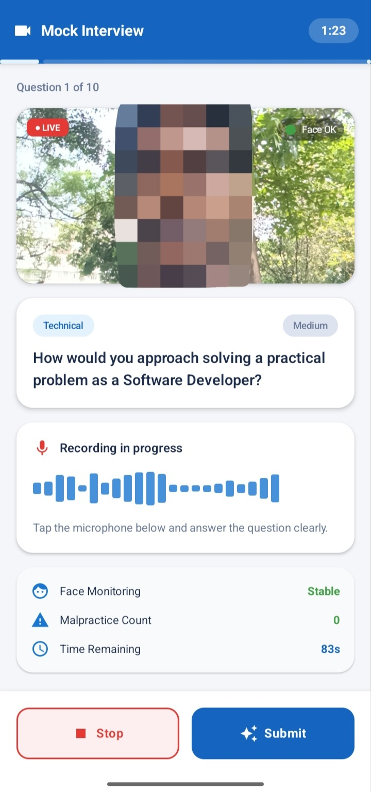 |

### 🎤 Voice Interview & Results

| Voice Interview | Recording | AI Feedback | Progress & Analytics |
|:---:|:---:|:---:|:---:|
| 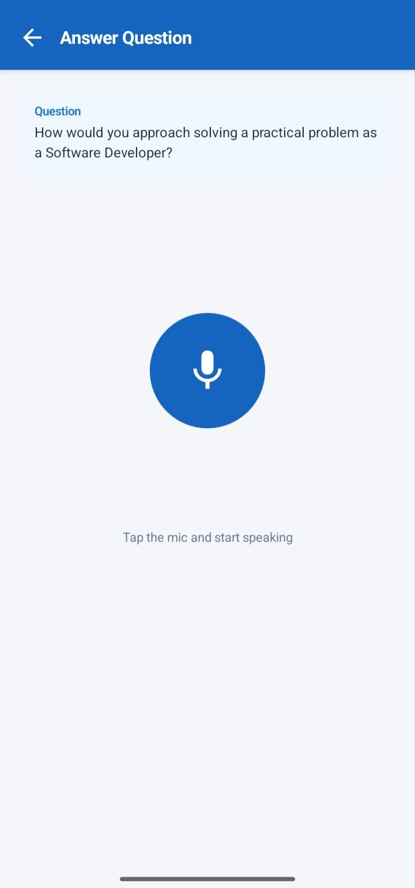 | 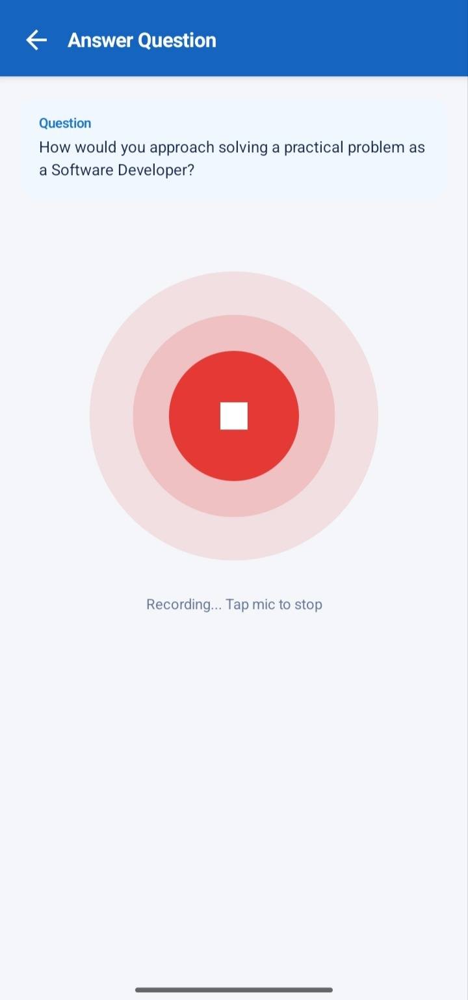 | 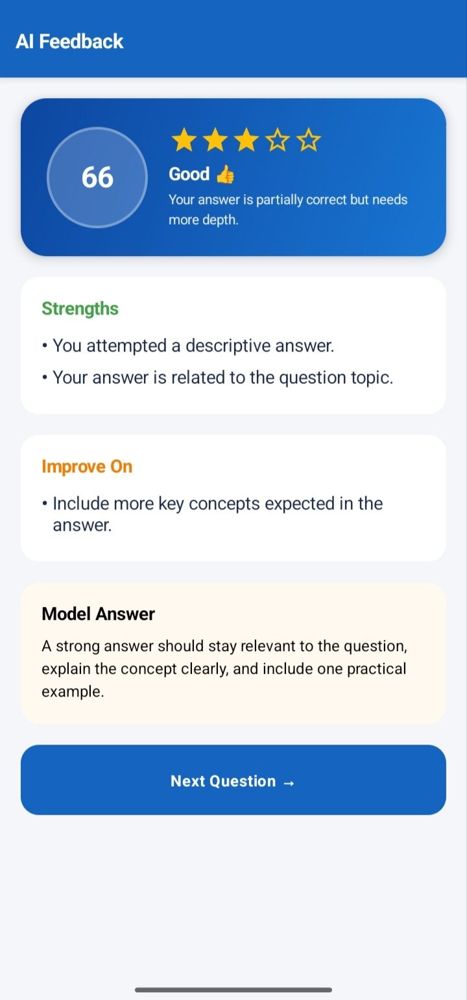 | 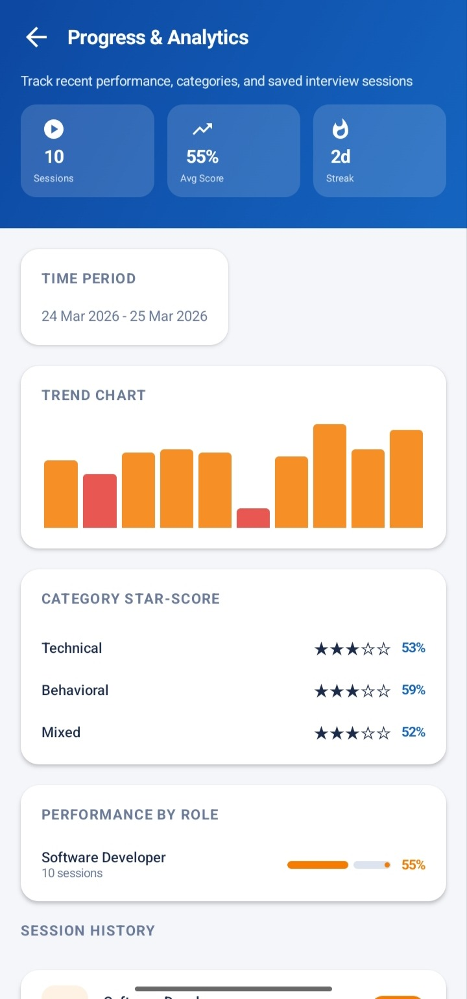 |

> 📄 [**View complete Screenshots PDF**](./AI%20interview%20Screenshots.pdf)

---

## 🛠️ Tech Stack

| Layer | Technology |
|-------|-----------|
| **Platform** | Android |
| **Language** | Kotlin |
| **IDE** | Android Studio |
| **UI Framework** | Jetpack Compose |
| **Architecture** | MVVM |
| **Authentication** | Firebase Authentication (Email + Google) |
| **Database** | Firebase Cloud Firestore |
| **File Storage** | Android Internal Storage |
| **AI Engine** | Google Gemini 2.5 Flash (REST API) |
| **Face Detection** | Google ML Kit |
| **Camera** | CameraX (Jetpack) |
| **Image Loading** | Coil |
| **Dependency Injection** | Hilt |
| **Build System** | Gradle |

---

## 🤖 AI Integration

The app integrates **Google Gemini 2.5 Flash** directly — no separate backend server.

```
📄 Resume PDF
      ↓
Gemini 2.5 Flash  ──►  Skills + Experience Level + Recommended Roles

Role + Difficulty + Category
      ↓
Gemini 2.5 Flash  ──►  Interview Questions

🎤 User Voice Answer (transcribed)
      ↓
Gemini 2.5 Flash  ──►  Score + Strengths + Improvement Tips + Model Answer
```

---

## 📁 Project Structure

```
AI-Interview-Trainer/
│
├── app/src/main/java/com/aiinterviewtrainer/
│   ├── data/
│   │   ├── local/               # Local storage helpers
│   │   ├── model/               # Data models
│   │   └── repository/          # Data repositories
│   ├── di/                      # Hilt dependency injection
│   └── ui/
│       ├── auth/                # Login, Register, Google Sign-In
│       ├── dashboard/           # Home screen
│       ├── navigation/          # Nav graph
│       ├── profile/             # Profile setup & view
│       ├── progress/            # Analytics & history
│       ├── resume/              # Upload & AI analysis
│       ├── roles/               # Role selection
│       ├── session/             # Setup, Q&A, face verify, mock
│       ├── splash/              # Splash screen
│       ├── theme/               # Compose theme
│       └── components/          # Shared UI components
│
├── Screenshots/                 # App Screenshots (.jpeg)
├── APK/                         # APK release
├── Ai interview trainer documentation 2.pdf
├── AI interview Screenshots.pdf
└── README.md
```

---

## 🗄️ Database Structure

```
Firebase Authentication
        │ User UID
        ▼
Cloud Firestore
        │
        ├── users/{uid}
        │     ├── name, email, college
        │     ├── graduationYear, phone
        │     ├── selectedRoles[ ]
        │     ├── profilePhotoPath
        │     └── resumePath
        │
        └── sessions/{sessionId}
              ├── userId, role, type
              ├── difficulty, questionCount
              ├── overallScore, questionScores[ ]
              ├── feedbackSummary
              ├── durationSeconds
              └── date
```

---

## 📋 Modules

| # | Module | Description |
|---|--------|-------------|
| 1 | Authentication | Firebase email/password & Google Sign-In |
| 2 | Profile Management | Name, college, graduation year, phone, photo |
| 3 | Resume Upload & Analysis | PDF upload + Gemini AI analysis |
| 4 | Role Selection | AI-recommended + manual + custom roles |
| 5 | Dashboard | Stats, recent sessions, quick actions |
| 6 | Session Setup | Role, difficulty, category, mode |
| 7 | Face Verification | ML Kit face scan pre-mock interview |
| 8 | Question Generation | Gemini-generated role-based questions |
| 9 | Voice Answer | Record, transcribe, submit answers |
| 10 | AI Feedback | Score, strengths, tips, model answer |
| 11 | Mock Interview Monitoring | Real-time malpractice detection |
| 12 | Session Summary | Overall score + question-wise breakdown |
| 13 | Progress & Analytics | Trend chart, category scores, history |

---

## 📥 Download

[](../../releases/latest)

**To install:**
1. Download the APK from the Releases section above
2. On your Android phone go to **Settings → Install unknown apps** → allow your file manager
3. Open the APK file → tap **Install**

> Minimum Android version: **8.0 (API 26)**

---

## 🚀 Setup & Installation

### Prerequisites
- Android Studio (Giraffe or later)
- Android SDK API 26+
- Firebase project with Auth and Firestore enabled
- Gemini API key from [Google AI Studio](https://aistudio.google.com/)

### Steps

**1. Clone**
```bash
git clone https://github.com/ManushGR12/AI-Interview-Trainer.git
cd AI-Interview-Trainer
```

**2. Firebase Setup**
- Create a Firebase project → Add Android app
- Package name: `com.aiinterviewtrainer`
- Download `google-services.json` → place in `app/`
- Enable: Firebase Authentication · Google Sign-In · Cloud Firestore

**3. Add Gemini API Key**
```properties
# local.properties  (never commit this file)
GEMINI_API_KEY=your_gemini_api_key_here
```

**4. Build**
```bash
# Windows
.\gradlew.bat assembleDebug

# Linux / macOS
./gradlew assembleDebug
```
APK output: `app/build/outputs/apk/debug/`

**5. Run**

Connect a device or start an emulator → click **Run ▶** in Android Studio

---

## 🔒 Security

- Firebase Authentication for all user access
- Firestore Security Rules restrict users to their own data
- `local.properties` excluded from Git via `.gitignore`
- Gemini API key is never committed to the repository
- Each developer must create their own Firebase config and API key

> ⚠️ **Never publish your actual Gemini API key in source code or README**

---

## 🧪 Testing Summary

20 test cases executed across all modules — all **passed ✅**

| Module | Test Cases |
|--------|-----------|
| Authentication | Register, Login, Google Sign-In |
| Profile | Create & Update |
| Resume | PDF Upload, AI Analysis |
| Role Selection | AI roles, Custom role |
| Dashboard | Stats display |
| Session Setup | Configure & start |
| Face Verification | Single face, Multiple faces |
| Question Generation | AI questions |
| Voice Answer | Record & transcribe |
| AI Feedback | Evaluate & display |
| Mock Interview | No-face warning |
| Session Summary | Results display |
| Session Details | Previous session view |
| Progress | Analytics display |
| Data Storage | Firestore write |

> 📘 Full test cases in [Project Documentation](./Ai%20interview%20trainer%20documentation%202.pdf)

---

## 📄 Documentation

| Document | Link |
|----------|------|
| 📘 Full Project Documentation | [Documentation AI.pdf](./Documentation%20AI.pdf) |
| 📸 App Screenshots | [AI interview Screenshots.pdf](./AI%20interview%20Screenshots.pdf) |

---

## 👨‍💻 Author

<div align="center">

**Manush G R**

<br/>

[](https://github.com/ManushGR12)&nbsp;
[](https://www.linkedin.com/in/manush-g-r-8bbb23363/)

</div>

---

## 📜 License

This project is licensed under the **MIT License**.

---

<!-- Animated Footer Banner -->
<div align="center">


</div>
